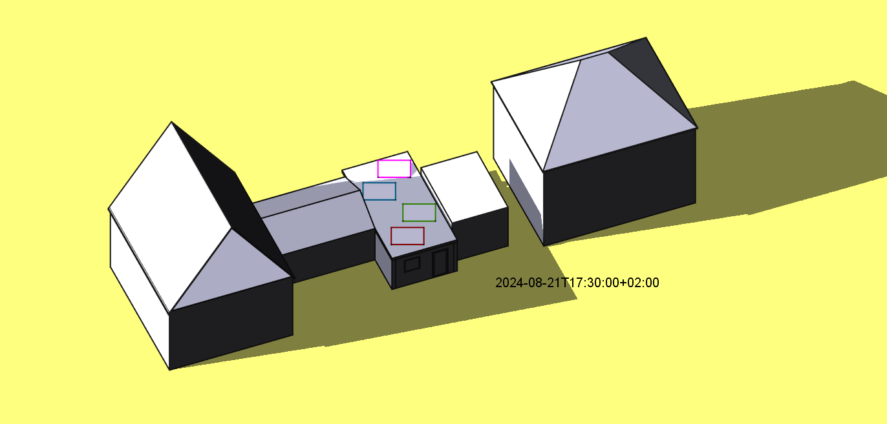
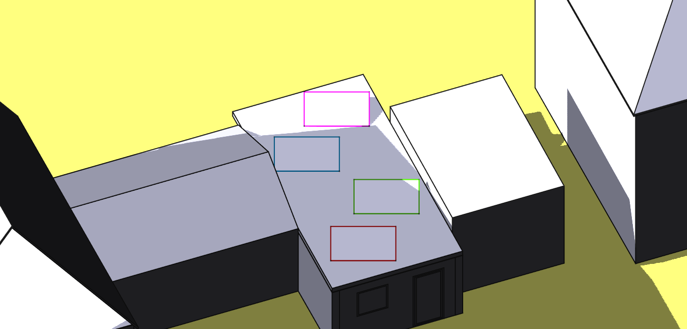

# Estimate solar panel illumination

To optimize the positioning of solar panels to maximize their power output it is necessary to
estimate the illumination of them.

The position of the sun relative to the solar panels can
easily be calculated using e.g. the Python package [`pysolar`](https://pysolar.org/)
which can also be used to calculate the solar clear-sky radiation. Using
[Lambert's cosine law](https://en.wikipedia.org/wiki/Lambert%27s_cosine_law) the usable
part of the solar radiation per panel can be calculated. What needs more effort is the
estimation of the effect of shadow by surrounding buildings on the power output of panels.

There are forum posts [[1]](https://forum.freecad.org/viewtopic.php?t=51559),
[[2]](https://forum.freecad.org/viewtopic.php?p=681193#p681193),
[[3]](https://forum.freecad.org/viewtopic.php?t=80254)
about using [`FreeCAD`](https://www.freecad.org/),
especially the ("FreeCAD Link Branch")[https://github.com/realthunder/FreeCAD] by `realthunder`.
However, I have not found any code to do this automatically.

The aim of code here is to calculate automatically different factors influencing the power output
of solar panels: The ratio of it in shadow, the solar clear-sky radiation, the effective radiation
considering the angle between the solar radiation and the panel surface.

Here is an example of the geometry with two houses, two garages and a patio with roof.

## Shadow analysis

The main idea of the shadow analysis is to get the position (elevation, azimuth) of the sun for a given date and time, set the light source of `FreeCAD` correspondingly and use the image rendered by `FreeCAD`. Currently, the only way to access this image seems to dump a screenshot and evaluate
it with an additional library like [`OpenCV`](https://pypi.org/project/opencv-python/).

The code here dumps a screenshot of each panel without surrounding buildings and other panels, uses this to set a lower limit for the brightness of pixel "in the sun" Then the full image is evaluated with all buildings and panels visible. Pixels of a panel whose values are below this brightness limit value (actually 99 % of it) will be identified as being shadowed. To find the panels in the image, the code uses `OpenCV` to find the panel surface by searching for its frame which is set to a defined color.

The image used for evaluation is a more detailed one of the garage roof, where the panels should be located. It is still important to include all surrounding buildings in this image, otherwise the shadow of builds might not be rendered by `FreeCAD`.

